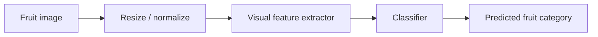

<div align="center">

# FruitRecognition
### Early Computer-Vision Project Archive


</div>

## Overview

This repository was created for an early **fruit-recognition / image-classification** project during my undergraduate exploration of intelligent systems.

The original implementation is **not present in the current public repository**, so this page intentionally avoids claiming a specific neural architecture, dataset, accuracy, or runnable training pipeline. It is preserved as a historical project placeholder and as part of the timeline leading to my later work in machine learning and intelligent systems.

## Intended Problem

The project topic is visual recognition of fruit categories from input images. A typical pipeline for this task would have the following form:



This diagram describes the **project concept**, not a reconstruction of missing source code.

## What Is Currently Available?

```text
FruitRecognition/
└── README.md
```

There are currently no public source files, model checkpoints, datasets, or original screenshots from the implementation period.

## What a Reproducible Release Would Require

If the original project files are recovered in the future, a complete release should ideally include:

- data-loading and preprocessing code;
- train/validation/test split description;
- model definition;
- training and inference commands;
- evaluation metrics;
- example predictions / UI screenshots;
- dependency specification.

Until those materials are available, this repository remains clearly labeled as an archive rather than a finished open-source implementation.

## Portfolio Context

FruitRecognition belongs to an early stage of my undergraduate exploration of AI. My subsequent work moved through **machine learning → graph learning and diffusion → spatiotemporal intelligence → LLM-based reasoning → Agentic AI**.

## Maintainer

**Bo Liu**  
Contact: `liubo317@hnu.edu.cn`  
Homepage: https://boliupro.github.io
